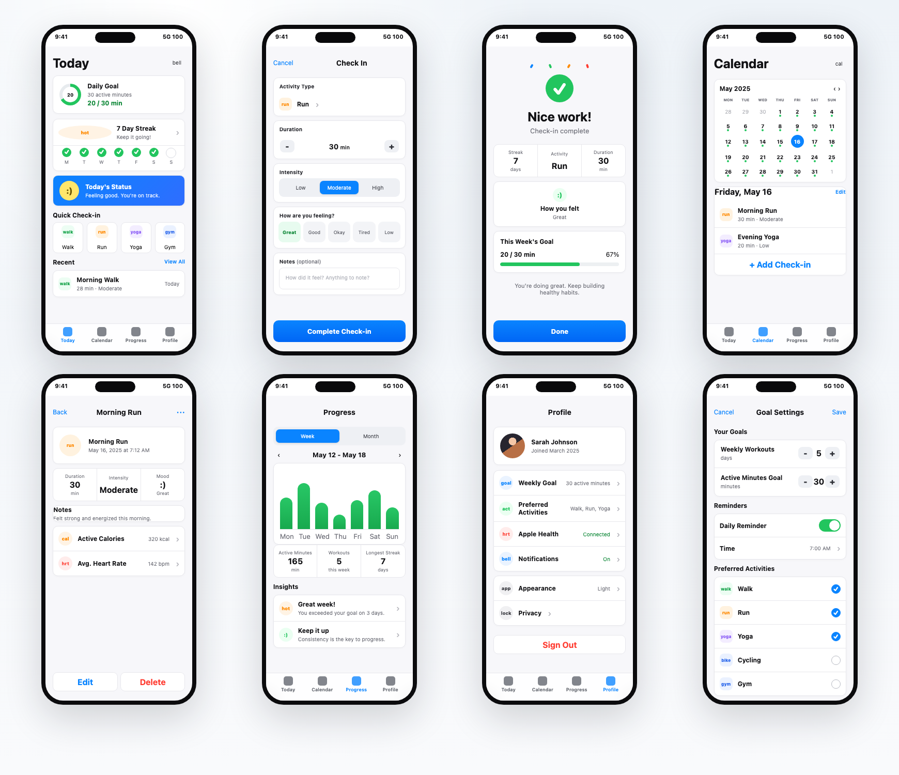
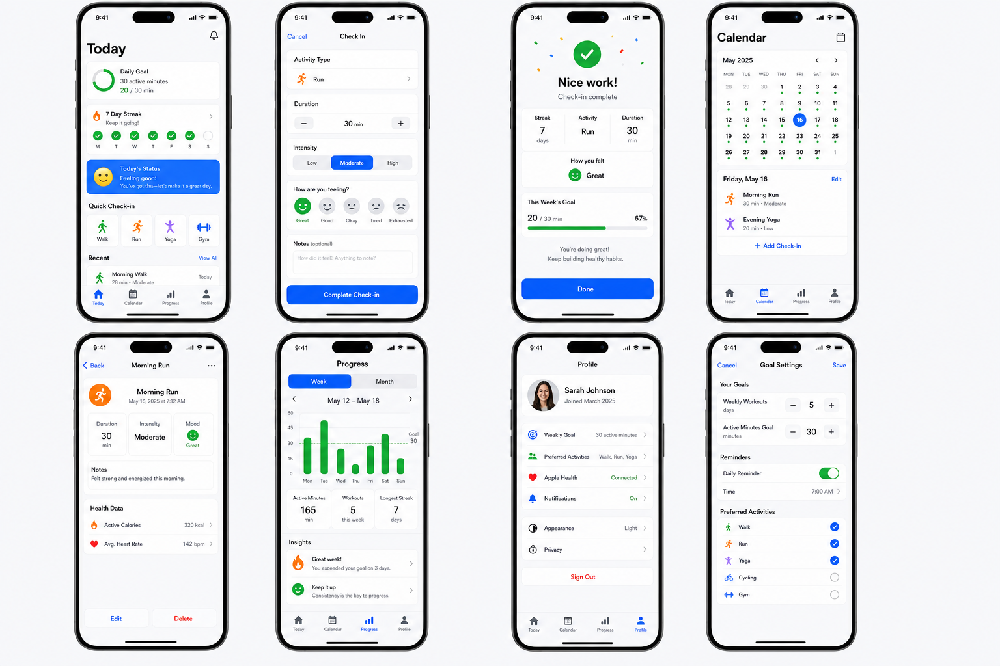

# ui-design

English | [中文](./README.md) | [العربية](./README_AR.md)

Sanbao UI Design is a set of product and UI design Skills for Codex. It does not jump from a vague idea straight to a rendered image. Instead, it clarifies the product requirement first, generates a multi-page UI design board, and only proceeds to high-fidelity HTML handoff after the user confirms the design.

## Skills

This repository contains two companion Skills:

- `sanbao-product-manager`: Product management Skill. Clarifies product positioning, target users, core flows, first-level and second-level pages, MVP scope, edge states, and acceptance criteria.
- `sanbao-ui-design`: UI design handoff Skill. Generates multi-page design boards in iOS SwiftUI or Element UI style after the product plan is confirmed, then produces high-fidelity HTML mockups after the user approves the design.

Recommended flow:

```text
Product idea
-> sanbao-product-manager clarifies requirements
-> User confirms product plan
-> sanbao-ui-design generates UI design board
-> User confirms design board
-> Generate high-fidelity HTML handoff
```

## Directory Structure

```text
.
├── README.md
├── README_EN.md
├── README_AR.md
├── skills/
│   ├── sanbao-product-manager/
│   │   ├── SKILL.md
│   │   ├── agents/
│   │   │   └── openai.yaml
│   │   └── references/
│   │       ├── requirements.md
│   │       ├── product-loop.md
│   │       ├── page-architecture.md
│   │       └── ui-brief.md
│   └── sanbao-ui-design/
│       ├── SKILL.md
│       ├── agents/
│       │   └── openai.yaml
│       └── references/
│           ├── mockup-core.md
│           ├── swiftui.md
│           └── element-ui.md
└── examples/
    └── fitness-checkin/
        ├── index.html
        ├── styles.css
        ├── assets/
        │   └── fitness-checkin-design-board.png
        └── screenshots/
            └── fitness-checkin-html.png
```

## Example

Sample project: A lightweight fitness check-in iOS app.

Product direction:

- For everyday fitness users, not complex strength training.
- Daily fitness check-in with exercise type, duration, intensity, and mood tracking.
- Calendar history, weekly progress, personal goals, and reminder settings.
- Uses native iOS SwiftUI visual language.

Pages:

- `Today`
- `Check In`
- `Check-in Result`
- `Calendar`
- `Activity Detail`
- `Progress`
- `Profile`
- `Goal Settings`

Files:

- [examples/fitness-checkin/index.html](./examples/fitness-checkin/index.html): High-fidelity HTML mockup
- [examples/fitness-checkin/styles.css](./examples/fitness-checkin/styles.css): Page styles
- [examples/fitness-checkin/assets/fitness-checkin-design-board.png](./examples/fitness-checkin/assets/fitness-checkin-design-board.png): Original design board
- [examples/fitness-checkin/screenshots/fitness-checkin-html.png](./examples/fitness-checkin/screenshots/fitness-checkin-html.png): HTML mockup screenshot

### HTML Mockup



### Design Board



## Usage

Copy the Skills to your Codex Skills directory:

```bash
cp -R skills/sanbao-product-manager ~/.codex/skills/
cp -R skills/sanbao-ui-design ~/.codex/skills/
```

Start with product clarification:

```text
Use $sanbao-product-manager to clarify this app idea into a product plan before UI design.
```

After confirming the product plan, proceed to UI design:

```text
Use $sanbao-ui-design to generate a pure iOS SwiftUI multi-screen design board from this confirmed product plan.
```

After confirming the design board, generate HTML:

```text
Generate a high-fidelity HTML mockup based on this design board.
```

Preview the example:

```bash
open examples/fitness-checkin/index.html
```

Note: `sanbao-ui-design` requires design board confirmation before generating HTML. It will not jump from a vague idea directly to a high-fidelity page.
